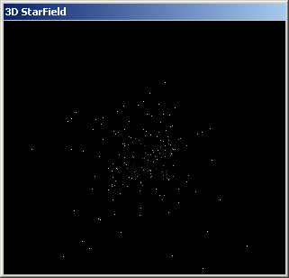

## Starfield \(3D\) \- Better than the Windows Screensaver\!

### Description

This is the first (to my knowledge) 3D Starfield on PSC.VB. You can learn the equations for converting 3D coords to 2D coords, such as the ones used in this source code. My next project is a full blown 3D modeler... right after I learn raytracing.
 
### More Info
 
Ammount of Stars

Speed of Stars

Distance of Star Origin

Sometimes changing the distance will cause math problems with the star Z coordinants.

             |
---                |---
**Submitted On**   |2000-02-06 16:59:00
**By**             |[Mike Bowers](https://github.com/Planet-Source-Code/PSCIndex/blob/master/ByAuthor/mike-bowers.md)
**Level**          |Intermediate
**User Rating**    |4.7 (14 globes from 3 users)
**Compatibility**  |VB 6\.0
**Category**       |[Graphics](https://github.com/Planet-Source-Code/PSCIndex/blob/master/ByCategory/graphics__1-46.md)
**World**          |[Visual Basic](https://github.com/Planet-Source-Code/PSCIndex/blob/master/ByWorld/visual-basic.md)
**Archive File**   |[Starfield 186924222001\.zip](https://github.com/Planet-Source-Code/mike-bowers-starfield-3d-better-than-the-windows-screensaver__1-22611/archive/master.zip)

